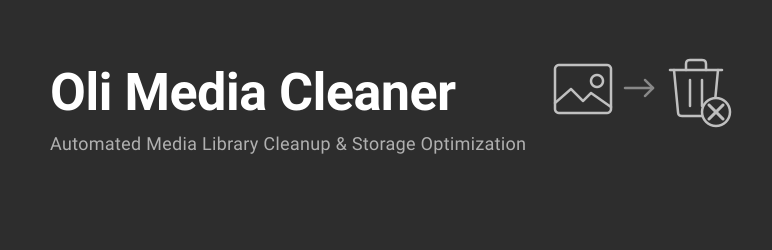

<p align="center">
  
</p>

<h1 align="center">Oli Media Cleaner</h1>

<p align="center">
  
</p>

<p align="center">
  <a href="https://github.com/bigrat95/oli-media-cleaner/releases"></a>
  <a href="https://wordpress.org/"></a>
  <a href="https://php.net/"></a>
  <a href="https://www.gnu.org/licenses/gpl-2.0.html"></a>
</p>

<p align="center">
  A WordPress plugin that scans your entire site to find and remove unused media files, freeing up disk space.<br>
  Performs deep analysis across 10+ sources to accurately determine which files are safe to remove.
</p>

---

## Table of Contents

- [Features](#features)
- [What Gets Scanned](#what-gets-scanned)
- [Installation](#installation)
- [Usage Guide](#usage-guide)
  - [Running a Scan](#running-a-scan)
  - [Managing Results](#managing-results)
  - [Search, Sort & Filter](#search-sort--filter)
  - [Trash All Unused](#trash-all-unused)
  - [Scheduled Auto-Cleanup](#scheduled-auto-cleanup)
- [Plugin Structure](#plugin-structure)
- [FAQ](#faq)
- [Screenshots](#screenshots)
- [Changelog](#changelog)
- [Contributing](#contributing)
- [License](#license)

---

## Features

| Feature | Description |
|---------|-------------|
| **Deep scanning** | Analyzes 10+ sources including post content, ACF, WooCommerce, Elementor, theme files, and more |
| **Batch processing** | Scans 50 attachments per batch to avoid server timeouts |
| **Whitelist** | Protect specific files from being flagged as unused |
| **Bulk actions** | Trash, whitelist, restore, or permanently delete multiple files at once |
| **Trash All** | One-click batch trash of all unused images with real-time progress bar |
| **Auto-cleanup** | Schedule daily, twice daily, or weekly automatic scan and trash via WP-Cron |
| **Search** | Filter images by name, filename, type, or ID across all tabs |
| **Sort** | Click column headers to sort by Name, Size, Type, or Date (asc/desc) |
| **Filter by type** | Dynamic dropdown showing only file types found in your scan (grouped by category) |
| **Per-page control** | Choose to display 20, 50, or 100 items per page |
| **Native WordPress UI** | Uses WordPress admin styles exclusively -- no external CSS frameworks |
| **Zero custom tables** | Stores all data in WordPress options |
| **Clean uninstall** | Removes all plugin data when deleted |

---

## What Gets Scanned

The plugin checks these sources to determine which media files are "in use":

- **Post & page content** -- all post types, Gutenberg blocks, classic editor
- **Featured images** -- all post types including custom post types
- **Custom fields (postmeta)** -- any plugin/theme that stores attachment IDs or URLs
- **ACF (Advanced Custom Fields)** -- image, file, gallery, repeater, flexible content, group, clone fields, and Options pages
- **WooCommerce** -- product galleries, variation images
- **Elementor** -- page builder widget data (`_elementor_data`)
- **Theme files** -- PHP, CSS, JS files scanned for hardcoded `/wp-content/uploads/` references
- **CSS background images** -- inline `background-image` styles in post content
- **Widgets** -- image, gallery, text, custom HTML widgets
- **Site identity** -- site logo, site icon, custom header, background image
- **Serialized data** -- deep scan of complex plugin data structures in postmeta

---

## Installation

### From GitHub

1. Download the [latest release](https://github.com/bigrat95/oli-media-cleaner/releases)
2. Upload the `oli-media-cleaner` folder to `/wp-content/plugins/`
3. Activate the plugin in **Plugins > Installed Plugins**
4. Go to **Media > Oli Media Cleaner** in the admin sidebar

### From WordPress Admin

1. Go to **Plugins > Add New**
2. Search for **Oli Media Cleaner**
3. Click **Install Now**, then **Activate**
4. Go to **Media > Oli Media Cleaner**

---

## Usage Guide

### Running a Scan

1. Navigate to **Media > Oli Media Cleaner** in your WordPress admin
2. Click the **Scan for Unused Media** button
3. A progress bar will show real-time scanning progress
4. Once complete, the results appear in the **Unused** tab

The scan processes attachments in batches of 50 to prevent server timeouts. The last scan date is displayed next to the scan button.

### Managing Results

The plugin provides three tabs:

#### Unused Tab
Shows all media files not found in any scanned source.

- **View** -- opens the file in a new tab
- **Edit** -- opens the WordPress media editor
- **Whitelist** -- protects the file from future scans
- **Trash** -- moves the file to WordPress trash

#### Whitelist Tab
Shows protected files that will never be flagged as unused.

- **View** -- opens the file
- **Remove** -- removes from whitelist (will appear as unused on next scan)

#### Trash Tab
Shows trashed media files.

- **Restore** -- moves the file back out of trash
- **Delete** -- permanently deletes the file and all its thumbnails from disk

### Bulk Actions

Select multiple files using checkboxes, then use the bulk action buttons:

- **Select All** -- toggles all checkboxes on the current page
- **Trash Selected** / **Whitelist Selected** -- on the Unused tab
- **Remove from Whitelist** -- on the Whitelist tab
- **Restore Selected** / **Delete Permanently** -- on the Trash tab

### Search, Sort & Filter

#### Search
Type in the search box and press Enter or click **Search**. Searches by:
- File name/title
- Filename (URL)
- File extension
- Attachment ID

Clear the search box to reset.

#### Sort
Click any column header to sort:
- **Name** -- alphabetical (A-Z / Z-A)
- **Size** -- smallest/largest first
- **Type** -- by file extension
- **Date** -- newest/oldest first (default: newest first)

The active sort column shows an arrow indicator.

#### Filter by Type
Use the dropdown to filter by file type. Types are grouped into categories:
- **Images** -- JPG, PNG, GIF, WebP, SVG, etc.
- **Documents** -- PDF, DOC, XLSX, CSV, etc.
- **Video** -- MP4, MOV, AVI, WebM
- **Audio** -- MP3, WAV, OGG

Only file types found in your scan results appear in the dropdown.

#### Per-Page
Below the results table, choose to display **20**, **50**, or **100** items per page.

### Trash All Unused

For sites with thousands of unused files:

1. Click the red **Trash All Unused** button
2. Confirm the action in the dialog
3. The plugin processes files in batches of 50
4. A progress bar shows real-time progress (e.g., "45% -- 4,500 / 10,192 trashed")
5. Whitelisted files are never trashed

### Scheduled Auto-Cleanup

Automate the scan and trash process:

1. Scroll down to the **Scheduled Auto-Cleanup** section
2. Check **Enable Auto-Cleanup**
3. Choose a frequency: **Daily**, **Twice Daily**, or **Weekly**
4. Click **Save Settings**

The next scheduled run time is displayed. The cron job:
- Runs a full scan (same as manual scan)
- Automatically trashes all unused files
- Respects whitelisted files
- Updates scan results and date

The schedule is cleared on plugin deactivation.

---

## Plugin Structure

```
oli-media-cleaner/
├── oli-media-cleaner.php       # Main plugin file, constants, includes
├── readme.txt                  # WordPress.org readme
├── README.md                   # GitHub documentation (this file)
├── uninstall.php               # Cleanup on plugin deletion
├── index.php                   # Directory browsing protection
├── .gitignore
├── includes/
│   ├── class-scanner.php       # Core scanner (collects used IDs from 10+ sources)
│   ├── class-admin.php         # Admin UI, AJAX handlers, cron management
│   └── index.php
└── assets/
    ├── css/
    │   └── admin.css           # Minimal custom styles (~20 lines)
    ├── js/
    │   └── admin.js            # Scan, pagination, bulk actions, search, sort
    └── index.php
```

### Key Classes

| Class | File | Purpose |
|-------|------|---------|
| `OLIMC_Scanner` | `includes/class-scanner.php` | Collects used attachment IDs from all sources, calculates file sizes, resolves paths to IDs |
| `OLIMC_Admin` | `includes/class-admin.php` | Admin menu, page rendering, AJAX handlers, cron scheduling, stats |

### WordPress Options Used

| Option | Purpose |
|--------|---------|
| `olimc_version` | Installed plugin version |
| `olimc_scan_results` | Array of unused attachment data from last scan |
| `olimc_scan_date` | Timestamp of last scan |
| `olimc_whitelist` | Array of whitelisted attachment IDs |
| `olimc_scan_used_ids` | Temporary: used IDs during batch scan |
| `olimc_cron_enabled` | Whether auto-cleanup is enabled |
| `olimc_cron_frequency` | Cron frequency (daily, twicedaily, weekly) |

All options are removed on plugin uninstall.

---

## FAQ

### Is it safe to delete unused media?

The plugin moves files to WordPress trash first. You can review and restore before permanently deleting. **Always make a full backup before bulk deletion.**

### Does it work with ACF (Advanced Custom Fields)?

Yes. Uses the ACF API to discover all field groups and recursively scans image, file, gallery, repeater, flexible content, group, and clone fields -- including ACF Options pages.

### Does it work with WooCommerce?

Yes. Product featured images, gallery images, and variation images are all detected as "in use."

### Does it work with Elementor?

Yes. Scans Elementor's `_elementor_data` post meta for image and media references.

### Does it scan theme files?

Yes. All PHP, CSS, and JS files in the active theme (and parent theme) are scanned for hardcoded references to `wp-content/uploads/`.

### Can I whitelist images?

Yes. Whitelist individual images or bulk select multiple. Whitelisted images are never flagged as unused and are skipped during auto-cleanup.

### Does it create custom database tables?

No. The plugin uses WordPress options only. Lightweight and clean.

### Will it slow down my site?

No. The plugin only loads its assets on the plugin's admin page. Nothing runs on the frontend.

### What happens when I uninstall?

All plugin options and cron schedules are removed. Your media files are not affected.

---

## Screenshots

### Main Dashboard
Stats overview with total media, in-use count, unused count, space to free, and whitelisted count. Scan button with last scan date. Tabbed interface (Unused / Whitelist / Trash) with bulk actions, search, sort, and file type filter.


### Pagination & Auto-Cleanup
Per-page selector, pagination controls, and the Scheduled Auto-Cleanup settings panel with frequency options and next run info.


---

## Changelog

### 1.5.0
- Renamed plugin from "Delete Unused Images" to "Oli Media Cleaner"
- New slug: `oli-media-cleaner`, new prefix: `olimc_`
- Added "Empty Trash" button with batch progress bar
- Added taxonomy image scanning
- Live tab count updates during batch operations

### 1.4.0
- Fixed all WordPress Plugin Check errors
- Proper output escaping (`esc_html_e`, `esc_html__`, `esc_html`)
- Translators comments for all placeholder strings
- Ordered placeholders for multi-placeholder strings
- Fixed SQL preparation with `$wpdb->prepare()` and `esc_like()`
- Dynamic file type filter (only shows detected extensions)
- Per-page selector (20, 50, 100)

### 1.3.0
- Clickable column headers to sort by Name, Size, Type, or Date
- File type filter dropdown grouped by category
- Sort indicators on active column

### 1.2.0
- Search box to filter images by name, filename, type, or ID
- Search works across all tabs

### 1.1.0
- "Trash All Unused" button with batch progress bar
- Scheduled auto-cleanup via WP-Cron (daily, twice daily, weekly)
- Settings panel for auto-cleanup configuration

### 1.0.0
- Initial release
- Deep scanning across 10+ sources
- Whitelist, trash, and permanent delete with bulk actions
- Native WordPress admin UI

---

## Contributing

Contributions are welcome! Please:

1. Fork the repository
2. Create a feature branch (`git checkout -b feature/my-feature`)
3. Commit your changes (`git commit -m 'Add my feature'`)
4. Push to the branch (`git push origin feature/my-feature`)
5. Open a Pull Request

---

## License

This plugin is licensed under the [GPL-2.0-or-later](https://www.gnu.org/licenses/gpl-2.0.html).

---

**Author:** [Olivier Bigras](https://olivierbigras.com)
**GitHub:** [bigrat95/oli-media-cleaner](https://github.com/bigrat95/oli-media-cleaner)
